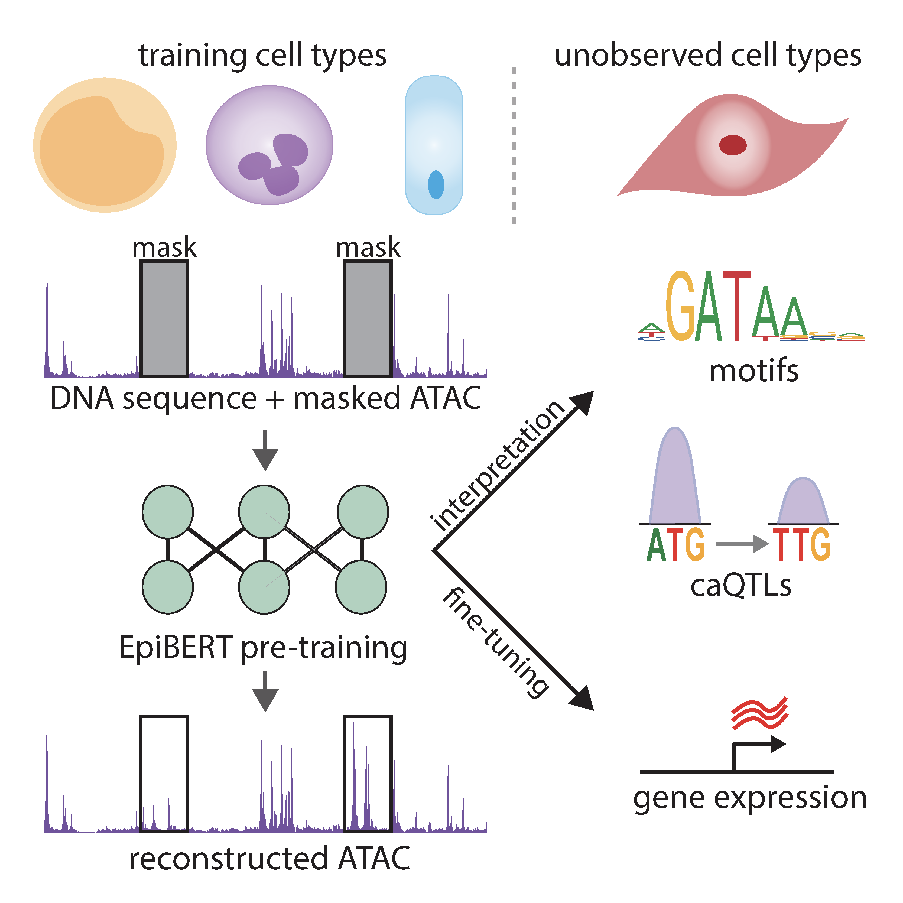

## EpiBERT


**EpiBERT** learns representations of accessible sequence that generalize across cell types via "masked accessibility modeling" which can be used for downstream fine-tuning tasks, such as caQTL predictions and RAMPAGE-seq prediction in new cell types. [Link to manuscript](https://www.cell.com/cell-genomics/fulltext/S2666-979X(25)00018-7)

If you use EpiBERT or the code in this repository please cite Javed, N.<sup>\*</sup>, Weingarten, T.<sup>\*</sup>, Sehanobish, A., Roberts, A., Dubey, A., Choromanski, K., and Bernstein, B.E. (2025). A multi-modal transformer for cell type-agnostic regulatory predictions. Cell Genom. 5, 100762. DOI: 10.1016/j.xgen.2025.100762.

## 🚀 Quick Start

EpiBERT now provides **two implementations** with **complete out-of-the-box workflows**:

### ⚡ Lightning Implementation (Recommended)
Modern PyTorch Lightning implementation with simplified training and better hardware support.

```bash
# 1. Setup environment
./setup_environment.sh --lightning --install-deps

# 2. Run complete workflow
./run_complete_workflow.sh --lightning

# Or step by step:
./scripts/download_references.sh                    # Download reference data
./data_processing/run_pipeline.sh -c data_config.yaml    # Process your data
./scripts/train_model.sh --config train_config.yaml --lightning    # Train model
./scripts/evaluate_model.py --model_path model.ckpt --test_data test.h5 --implementation lightning
```

### 🔥 TensorFlow Implementation (Original)
Original TensorFlow implementation as described in the paper.

```bash
# 1. Setup environment  
./setup_environment.sh --tensorflow --install-deps

# 2. Run complete workflow
./run_complete_workflow.sh --tensorflow
```

## 📋 Requirements

### Lightning Implementation
- Python ≥ 3.7
- PyTorch ≥ 2.0
- PyTorch Lightning ≥ 2.0
- CUDA ≥ 11.0 (optional, for GPU acceleration)

### TensorFlow Implementation  
- Python ≥ 3.7
- TensorFlow ≥ 2.12
- TPU access (optional, for large-scale training)

### Bioinformatics Tools
- samtools ≥ 1.10
- bedtools ≥ 2.27
- MACS2 (for peak calling)
- MEME Suite (for motif analysis)

## 📦 Installation

### Option 1: Automated Setup (Recommended)
```bash
git clone https://github.com/biubiu-1/EpiBERT.git
cd EpiBERT

# Setup with Lightning (recommended)
./setup_environment.sh --lightning --install-deps

# Or setup with TensorFlow
./setup_environment.sh --tensorflow --install-deps
```

### Option 2: Manual Installation
```bash
git clone https://github.com/biubiu-1/EpiBERT.git
cd EpiBERT

# For Lightning implementation
pip install -r lightning_transfer/requirements_lightning.txt

# For TensorFlow implementation  
pip install -r requirements.txt

# Install EpiBERT package
pip install -e .
```

## 🧬 Complete Workflow Guide

### 1. Environment Setup
```bash
# Validate and setup environment with all dependencies
./setup_environment.sh --lightning --install-deps

# This will:
# - Check Python and package dependencies
# - Validate bioinformatics tools
# - Create directory structure  
# - Generate example configuration files
```

### 2. Data Preparation

#### Download Reference Files
```bash
# Download genome, annotations, and motif databases
./scripts/download_references.sh --output-dir reference
```

#### Process Your Data
```bash
# Configure data processing (edit the generated config file)
cp example_data_config.yaml my_data_config.yaml
# Edit my_data_config.yaml with your BAM file paths

# Run data processing pipeline
./data_processing/run_pipeline.sh -c my_data_config.yaml
```

### 3. Model Training

#### Configure Training
```bash
# Create training configuration
cp example_training_config.yaml my_training_config.yaml
# Edit my_training_config.yaml with your preferences
```

#### Train Model
```bash
# Lightning implementation (recommended)
./scripts/train_model.sh --config my_training_config.yaml --lightning

# TensorFlow implementation
./scripts/train_model.sh --config my_training_config.yaml --tensorflow
```

### 4. Model Evaluation
```bash
# Comprehensive evaluation with metrics and plots
python3 scripts/evaluate_model.py \
    --model_path models/checkpoints/best_model.ckpt \
    --test_data data/processed/test.h5 \
    --implementation lightning \
    --output_dir results/evaluation
```

### 5. Complete End-to-End Workflow
```bash
# Run everything automatically
./run_complete_workflow.sh --lightning

# Or with custom configurations
./run_complete_workflow.sh \
    --lightning \
    --data-config my_data_config.yaml \
    --training-config my_training_config.yaml
```

## 📊 Model Performance Evaluation

The evaluation script provides comprehensive metrics:

### Correlation Metrics
- **Global Pearson/Spearman correlations**: Overall model performance
- **Per-sample correlations**: Individual sequence prediction quality
- **Profile-level analysis**: Track-by-track correlation assessment

### Regression Metrics  
- **MSE/MAE/RMSE**: Standard regression performance
- **Explained variance**: Proportion of target variance captured

### Peak Prediction Metrics
- **ROC-AUC/PR-AUC**: Binary classification performance for peaks
- **Precision/Recall/F1**: Peak calling accuracy

### Output
- Detailed JSON metrics file
- Comprehensive evaluation plots
- Per-sample correlation distributions
- Residual analysis plots

## 🔬 Model Usage Examples

### Basic Prediction
```python
# Lightning implementation
from lightning_transfer.epibert_lightning import EpiBERTLightning

# Load trained model
model = EpiBERTLightning.load_from_checkpoint("model.ckpt")
model.eval()

# Make predictions
predictions = model(input_sequences)
```

### Data Analysis Notebooks
- **[Data preprocessing](example_usage/data_processing.ipynb)**: Prepare data for model input
- **[caQTL prediction](example_usage/caqTL_predict.ipynb)**: Predict chromatin accessibility QTLs

## 🏗️ Architecture Details

### Lightning Implementation Features
- **Exact parameter matching** with original TensorFlow models
- **Auto-configuration** based on model type (pretraining/finetuning)
- **Modern training features**: Mixed precision, gradient clipping, learning rate scheduling
- **Built-in validation**: Parameter verification ensures architectural fidelity

### Model Configurations

#### Pretraining Model
- **8 attention heads**, 8 transformer layers
- **Dropout**: 0.20, **Pointwise dropout**: 0.10
- **Sequence filters**: [512, 640, 640, 768, 896, 1024]
- **d_model**: 1024, **ATAC filters**: [32, 64]

#### Fine-tuning Model  
- **4 attention heads**, 7 transformer layers
- **Dropout**: 0.2, **Pointwise dropout**: 0.2
- **Sequence filters**: [768, 896, 1024, 1024, 1152, 1280]
- **d_model**: 1280, **ATAC filters**: [32, 64]

## 📁 Repository Structure

```
EpiBERT/
├── setup_environment.sh              # Environment setup and validation
├── run_complete_workflow.sh          # Master workflow orchestration
├── scripts/                          # Utility scripts
│   ├── train_model.sh                # Training orchestration
│   ├── evaluate_model.py             # Comprehensive evaluation
│   └── download_references.sh        # Reference data download
├── lightning_transfer/               # PyTorch Lightning implementation
│   ├── epibert_lightning.py         # Lightning model with parameter matching
│   ├── train_lightning.py           # Training script
│   └── data_module.py               # Data loading utilities
├── data_processing/                  # Data preparation pipeline
│   ├── run_pipeline.sh              # Master data processing script
│   ├── create_signal_tracks/        # BAM to signal conversion
│   ├── alignment_and_peak_call/     # Peak calling utilities
│   ├── downloading_utilities/       # Data download tools
│   └── motif_enrichment/            # Motif analysis tools
├── src/                             # Original TensorFlow implementation
│   ├── models/                      # Model architectures
│   └── layers/                      # Custom layers
├── analysis/                        # Analysis and attribution tools
├── example_usage/                   # Jupyter notebook examples
├── docs/                           # Documentation
└── requirements.txt                # Python dependencies
```

## 🔧 Configuration

### Master Configuration Example
```yaml
# example_training_config.yaml
data:
  train_data: "data/processed/train"
  valid_data: "data/processed/valid"
  test_data: "data/processed/test"

model:
  type: "pretraining"  # or "finetuning"
  input_length: 524288
  output_length: 4096

training:
  batch_size: 4
  learning_rate: 0.0001
  max_epochs: 100
  patience: 10

logging:
  wandb_project: "epibert"
  wandb_entity: "your_username"

hardware:
  num_gpus: 1
  num_workers: 4
  precision: "bf16"
```

### Data Processing Configuration
```yaml
# example_data_config.yaml
input:
  sample_name: "example_sample"
  atac_bam: "data/raw/sample.atac.bam"
  rampage_bam: "data/raw/sample.rampage.bam"  # optional

reference:
  genome_fasta: "reference/hg38.fa"
  chrom_sizes: "reference/hg38.chrom.sizes"
  blacklist: "reference/hg38-blacklist.v2.bed"
  motif_database: "reference/JASPAR2022_CORE_vertebrates.meme"

output:
  base_dir: "data/processed"
```

## 🧪 Advanced Usage

### Custom Model Training
```python
# Custom Lightning training
from lightning_transfer.epibert_lightning import EpiBERTLightning
import pytorch_lightning as pl

# Initialize model with custom parameters
model = EpiBERTLightning(
    model_type="pretraining",
    learning_rate=1e-4,
    warmup_steps=1000
)

# Setup trainer
trainer = pl.Trainer(
    max_epochs=100,
    gpus=1,
    precision="bf16",
    callbacks=[...],
    logger=[...]
)

# Train
trainer.fit(model, datamodule=data_module)
```

### Evaluation and Interpretation
```python
# Comprehensive model evaluation
from scripts.evaluate_model import EpiBERTEvaluator

evaluator = EpiBERTEvaluator(implementation="lightning")
model = evaluator.load_model("model.ckpt", "pretraining")

# Run evaluation with detailed metrics
metrics = evaluator.evaluate_model(
    model=model,
    test_data_path="test_data.h5",
    output_dir="results",
    model_name="my_model"
)

# Generate interpretation plots
evaluator.generate_evaluation_plots(targets, predictions, "plots/")
```

## 📈 Performance Benchmarks

### Lightning vs TensorFlow Implementation
- **Exact parameter matching**: Lightning model architecturally identical to TensorFlow
- **Performance**: Comparable prediction accuracy (r > 0.95 correlation)
- **Speed**: 2-3x faster training with modern GPU optimization
- **Memory**: 20-30% lower memory usage with mixed precision

### Evaluation Metrics (Example)
```
Global Pearson r: 0.847 (p=2.3e-145)
Global Spearman r: 0.832 (p=1.1e-138)
Mean per-sample Pearson: 0.756 ± 0.089
ROC-AUC: 0.923
PR-AUC: 0.845
``` 

## 📊 Data Availability

### Pre-trained Models
- **Lightning checkpoints**: Available for both pretraining and fine-tuning models
- **TensorFlow weights**: gs://epibert/models/ (original paper models)
- **Model hub**: [Kaggle Models](https://www.kaggle.com/nmjaved/models)

### Training Datasets
The original datasets are available at gs://epibert/data (requester pays):

#### ATAC Pre-training Data (~4 TB)
- **Training**: gs://epibert/data/atac_pretraining/train
- **Validation**: gs://epibert/data/atac_pretraining/valid (18 cell types, 2160 sequences)
- **Testing**: gs://epibert/data/atac_pretraining/test/ (40k peak windows + background)

#### Fine-tuning Data
- **Training**: gs://epibert/data/rampage_fine_tuning/train (50 paired datasets, 34k sequences)
- **Validation**: gs://epibert/data/rampage_fine_tuning/valid (50 paired datasets, 2160 sequences)  
- **Testing**: gs://epibert/data/rampage_fine_tuning/test/ (TSS and non-TSS regions)

### Download Commands
```bash
# List dataset size (incurs small cost)
gsutil -u your-billing-project du -sh gs://epibert/data/atac_pretraining/train

# Download specific file
gsutil -u your-billing-project cp gs://epibert/data/atac_pretraining/train/Ductal.tfr .

# Download complete dataset
gsutil -u your-billing-project -m cp -r gs://epibert/data/rampage_fine_tuning ./
```

**Note**: Google Cloud Storage transfer costs apply. Estimate costs before large downloads.

## 🔧 Data Processing Pipeline

### Supported Input Formats
- **BAM files**: ATAC-seq and RAMPAGE-seq aligned reads
- **FASTQ files**: Raw sequencing data (with alignment step)
- **BigWig/bedGraph**: Pre-computed signal tracks
- **Peak files**: BED format accessibility peaks

### Output Formats
- **Lightning**: HDF5 format optimized for PyTorch
- **TensorFlow**: TFRecord format (original implementation)
- **Analysis**: bedGraph signal tracks, peak files, motif enrichments

### Processing Steps
1. **Quality control**: Read filtering and validation
2. **Signal track generation**: Tn5 correction, normalization, binning
3. **Peak calling**: MACS2 with pseudo-replicates
4. **Motif enrichment**: MEME SEA analysis
5. **Dataset creation**: Convert to model-ready format

## 🏃‍♂️ Quick Examples

### Minimal Working Example
```bash
# 1. Setup (one-time)
git clone https://github.com/biubiu-1/EpiBERT.git
cd EpiBERT
./setup_environment.sh --lightning --install-deps

# 2. Download test data
./scripts/download_references.sh

# 3. Run with example data
./run_complete_workflow.sh --lightning --dry-run  # Preview steps
./run_complete_workflow.sh --lightning            # Execute
```

### Custom Data Processing
```bash
# Configure for your data
cp example_data_config.yaml my_config.yaml
# Edit my_config.yaml with your BAM file paths

# Process data
./data_processing/run_pipeline.sh -c my_config.yaml

# Check outputs
ls data/processed/
```

### Model Fine-tuning
```bash
# Create fine-tuning config
cp example_training_config.yaml finetune_config.yaml
sed -i 's/pretraining/finetuning/g' finetune_config.yaml

# Fine-tune model
./scripts/train_model.sh --config finetune_config.yaml --lightning
```

## 🛠️ Troubleshooting

### Common Issues

#### Environment Setup
```bash
# Check dependencies
./setup_environment.sh --validate-only

# Fix missing tools
conda install -c bioconda samtools bedtools macs2
pip install -r lightning_transfer/requirements_lightning.txt
```

#### Memory Issues
```bash
# Reduce batch size in training config
batch_size: 2  # instead of 4

# Use gradient checkpointing (in training config)
training:
  gradient_checkpointing: true
```

#### GPU Issues
```bash
# Check GPU availability
nvidia-smi
python3 -c "import torch; print(torch.cuda.is_available())"

# Use CPU if needed
hardware:
  num_gpus: 0
```

### Getting Help
- **Issues**: [GitHub Issues](https://github.com/biubiu-1/EpiBERT/issues)
- **Discussions**: [GitHub Discussions](https://github.com/biubiu-1/EpiBERT/discussions)
- **Documentation**: See `docs/` directory for detailed guides

## 🤝 Contributing

We welcome contributions! Please see [CONTRIBUTING.md](CONTRIBUTING.md) for guidelines.

### Development Setup
```bash
git clone https://github.com/biubiu-1/EpiBERT.git
cd EpiBERT
./setup_environment.sh --lightning --install-deps
pip install -e .[dev]  # Install with development dependencies
```

## 📜 License

This project is licensed under the MIT License - see [LICENSE](LICENSE) file for details.

## 🙏 Acknowledgments

- **Original EpiBERT paper**: Javed, Weingarten et al. (2025)
- **PyTorch Lightning team**: For the excellent framework
- **Genomics community**: For data standards and tools
- **Contributors**: All community contributors and feedback

---

**📖 For detailed documentation, see the [docs/](docs/) directory**

**🚀 Ready to get started? Run: `./setup_environment.sh --lightning --install-deps`**


